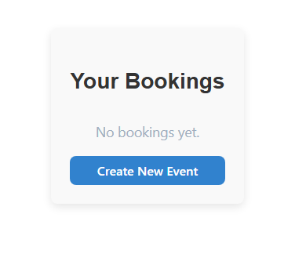
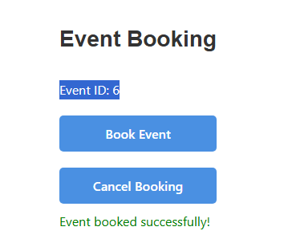
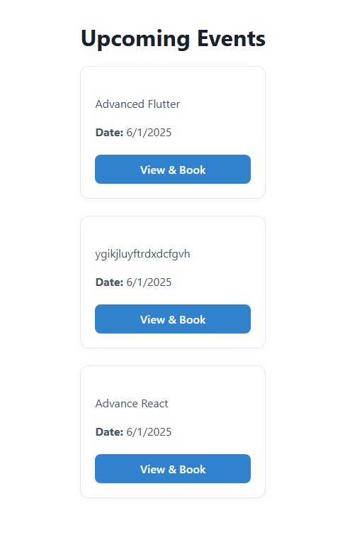
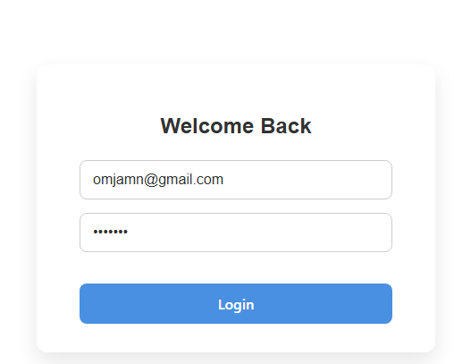
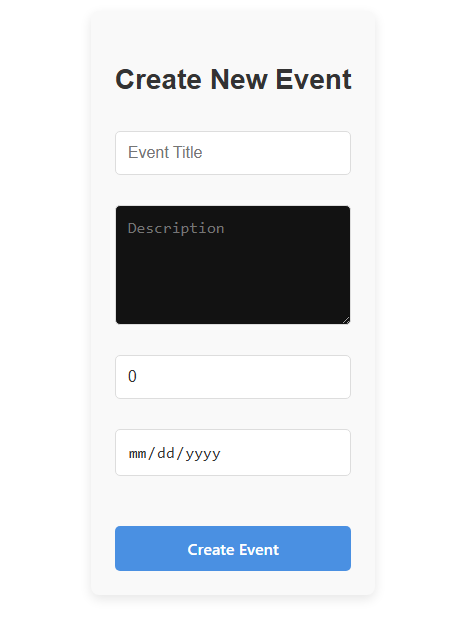
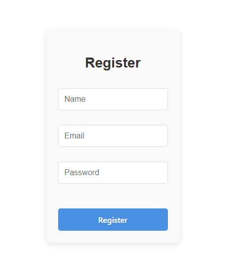
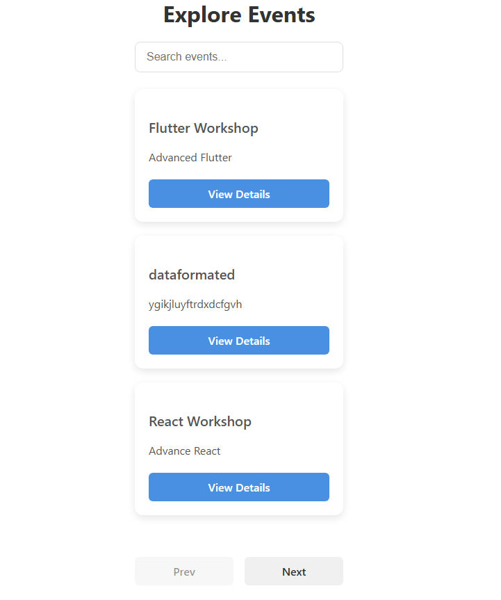

# 🎟️ Event Booking App

A full-stack web application to create, view, and book events. Includes admin features for managing bookings and events.

---

## 🌐 Live Demo (if hosted)

[🔗 View App](https://your-deployment-url.com)

---

## 🛠️ Tech Stack

### Frontend
- React + TypeScript
- Tailwind CSS
- Axios
- React Router

### Backend
- Node.js + Express
- MongoDB + Mongoose
- JWT for Authentication
- bcrypt for password hashing
- dotenv for environment management

---

## 📦 Installation

### 1. Clone the Repository
```bash
git clone https://github.com/your-username/event-booking-app.git
cd event-booking-app
```

---

### 2. Setup Backend

```bash
cd backend
npm install
```

Create a `.env` file:
```env
PORT=5000
MONGO_URI=mongodb://localhost:27017/event-booking
JWT_SECRET=your_jwt_secret
```

Start the server:
```bash
npm run dev
```

### 📸 Screenshots

#### Dashboard


#### Event Booking


#### Home Page


#### Login Page


#### Create New Event


#### Register Page


#### View Event


---

### 3. Setup Frontend

```bash
cd ../frontend
npm install
npm start
```

> The frontend will run on `http://localhost:3000`

---

## 🔐 Authentication

- **Register**: `/auth/register`
- **Login**: `/auth/login`
- JWT Token is stored and sent via headers for protected routes.

---

## 🌍 API Overview

### 🔹 Public

| Method | Endpoint      | Description           |
|--------|---------------|-----------------------|
| GET    | `/events`     | Get all events        |
| GET    | `/event/:id`  | Get event details     |

---

### 🔒 Authenticated

| Method | Endpoint           | Description            |
|--------|--------------------|------------------------|
| POST   | `/book/:eventId`   | Book an event          |
| GET    | `/user/bookings`   | View user bookings     |
| DELETE | `/book/:id`        | Cancel a booking       |

---

### 🛠 Admin

| Method | Endpoint      | Description             |
|--------|---------------|-------------------------|
| GET    | `/admin/book` | View all bookings       |

---

## 🧪 Sample Usage

### Register
```ts
axios.post("/auth/register", {
  name: "Alice",
  email: "alice@example.com",
  password: "securepass"
});
```

### Book Event
```ts
axios.post("/book/123456", {}, {
  headers: { Authorization: `Bearer <token>` }
});
```

---

## 📁 Folder Structure

```
event-booking-app/
├── backend/       # Node.js + Express backend
│   ├── routes/
│   ├── models/
│   ├── controllers/
│   └── server.ts
├── frontend/      # React + TypeScript frontend
│   ├── src/
│   │   ├── pages/
│   │   ├── components/
│   │   └── services/
└── README.md
```

---


## 🙌 Contributors

- [Your Name](https://github.com/your-username)
- [Collaborator Name](https://github.com/collab-username)

---

## 🛡 License

This project is licensed under the MIT License - see the [LICENSE](LICENSE) file for details.
